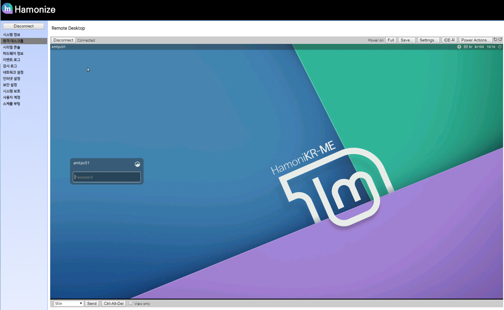

# AMT Console

Upstream : [https://github.com/Ylianst/MeshCommander](https://github.com/Ylianst/MeshCommander)

* 하모니카 PC를 intel AMT 기능이 지원되는 하드웨어에서 사용할 때 원격에서 PC
  관리를 사용할 수 있는 AMT 관리자 콘솔 (UEFI 모드만 지원)
* AMT Console 은 meshcommander(https://www.npmjs.com/package/meshcommander) 를
  하모니카 에서 사용할 수 있게 수정한 프로그램.

## 주요기능

 * Windosw 10 원격 설치 지원
 * HamoniKR 원격 설치 지원
 * Serial over Lan 지원
 * IDE-R 지원
 * Remote Desktop 지원 



## 사용법

release/ 디렉토리안의 아래 파일을 다운로드 받아서 실행
- (윈도우용) hamonize-amtctl-win*.exe
- (리눅스용) hamonize-amtctl-linux*

실행 후 웹 브라우저에서 http://127.0.0.1:3000 으로 접속

## 사용자 가이드

* [AMT Console 사용자 가이드](docs/user-guide.md)

<hr>

## 빌드 및 소스코드 실행

### Run
``` 
git clone https://github.com/ivsteam/hamonize-amt-webcmd.git
cd hamonize-amt-webcmd
npm start
```

### Single file deploy

```npm build```

### Test

http://127.0.0.1:3000/

### Issue or Bug

feel free post with github issue or mail sales@invesume.com


