## AMT Console 사용자 가이드

### 원격지 PC의 AMT 설정

 - 프로그램 사용 전 먼저 원격지 PC에서 AMT 설정이 필요합니다.
 - 컴퓨터 시작 시 CTRL+P 키를 이용하면 AMT 설정화면으로 진입할 수 있습니다.
 - 최초 AMT 설정화면의 로그인 비밀번호는 Admin(대소문자구분) 입니다.
 - 사용자 동의(User Consent) 기능을 비활성화 해야 원격에서 비밀번호를 입력하지
   않고 접속가능하므로 이 옵션을 해제하고 사용하는 것이 좋습니다. 만일 해제하지
   않으면 6자리의 비밀번호를 접속할 때마다 요구합니다.
   (https://software.intel.com/en-us/amt-developer-guide-user-consent)

### 프로그램 실행

 - release 디렉토리 안에서 자신이 사용하는 운영체제에 적합한 버전을 다운로드
   받습니다.
 - (윈도우용) hamonize-amtctl-win.exe
 - (리눅스용) hamonize-amtctl-linux

## AMT 콘솔 접속

다운로드 받은 파일을 실행 후 웹 브라우저에서 http://127.0.0.1:3000 으로
접속합니다.

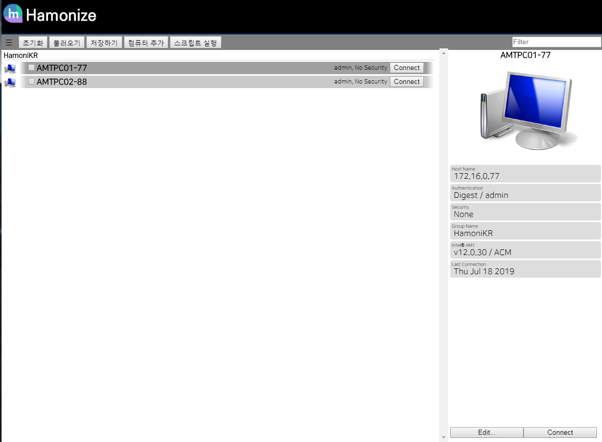

### 관리대상 PC 등록

관리할 대상을 등록하는 과정은 아래 화면과 같이 '컴퓨터 추가' 버튼을 이용합니다.

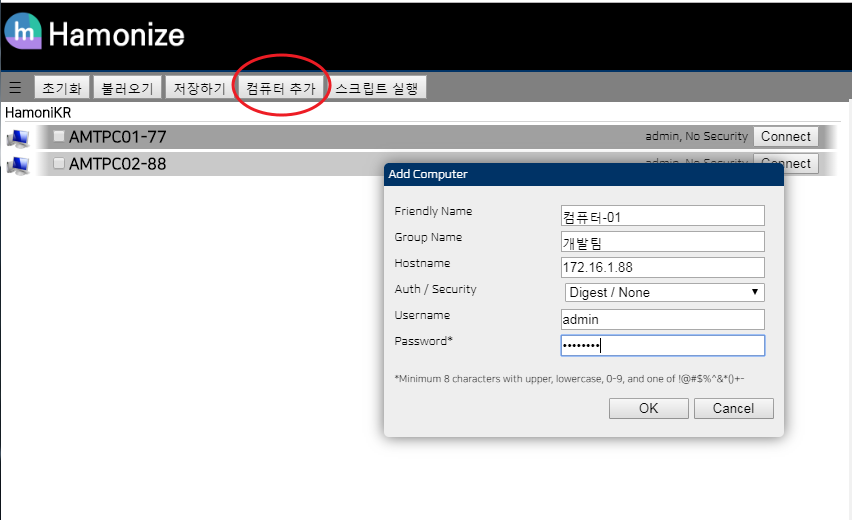

 - Hostname 은 접속할 대상 PC의 IP 를 입력합니다.
 - AMT 설정에서 별도의 사용자를 생성하지 않았다면 Username 필드는 admin 으로
   기본값을 사용합니다.
 - Password 는 AMT 설정 시 사용한 비밀번호를 입력합니다.

'불러오기' 버튼을 이용하면 다수의 컴퓨터를 일괄 등록하고 싶은 경우 json 형식의
데이터 파일을 이용하여 일괄 등록할 수 있습니다. (등록에 필요한 데이터 포멧은
'저장하기' 버튼을 눌러서 확인하세요)

### 원격지 PC 접속

원격 관리하고 싶은 PC에 접속하기 위해서는 아래와 같이 'Connect' 버튼을
이용합니다.

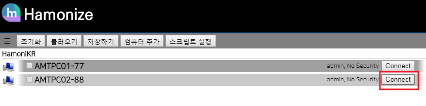

## 주요 기능

접속 후 다음과 같은 화면이 나타납니다.

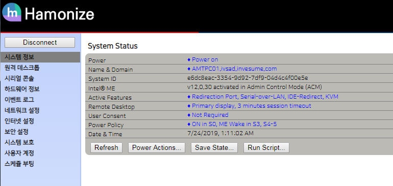

### 원격 데스크톱 기능

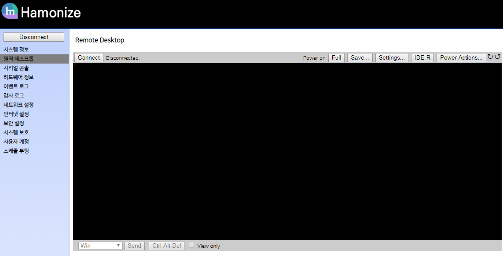

 - 컴퓨터 전원관리, 바이오스 제어, 원격 데스크톱 관리 기능을 수행합니다.
 - Remote Desktop 화면의 'Connect' 버튼을 이용하여 접속합니다. 접속화면은 아래와
   같습니다.

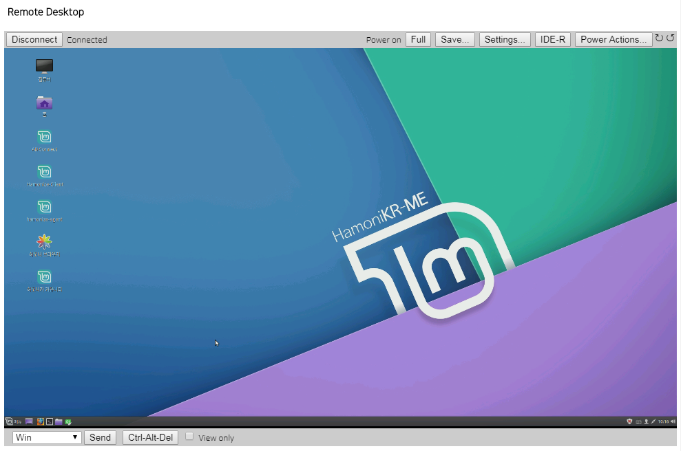

 - 화면의 해상도를 조절하기 위해서는 'Settings...' 버튼을 이용합니다.
 - 이미지 인코딩 방법과 품질을 설정하여 속도에 맞는 해상도를 선택할 수 있습니다.

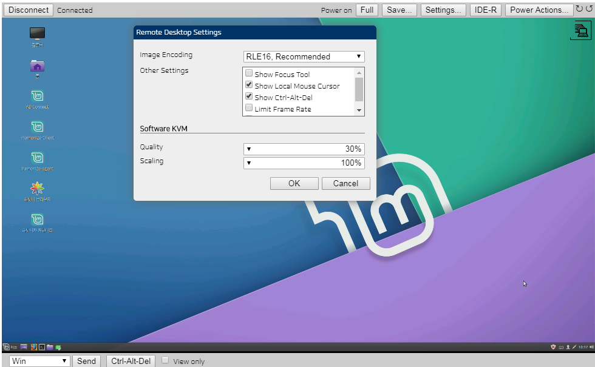

### 원격 전원관리 기능
 - 원격지 PC의 전원을 관리하기 위해서 'Power Actions..' 버튼을 누르면 다음과
   같은 화면이 나타납니다. 다양한 재시작 환경을 설정할 수 있습니다.
 - Reset: 컴퓨터 재 시작
 - Reset to BIOS : 컴퓨터 재 시작후 바이오스로 진입
 - Reset to IDE-R Floopy : 컴퓨터 재 시작후 IDE-R 이미지로 부팅

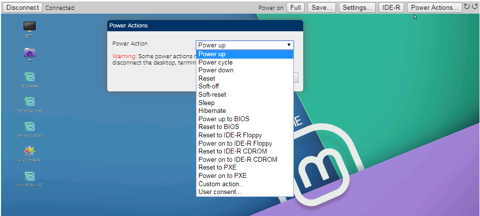

### 원격 OS 설치 기능 (IDE-R)

원격지의 저장장치를 로딩해서 사용하기 위해서 'IDE-R' 버튼을 누르면 다음과 같은
화면이 나옵니다. 표시한 것과 같이 img 를 선택하고 'OK' 버튼을 누르면
리다이렉션이 시작됩니다.

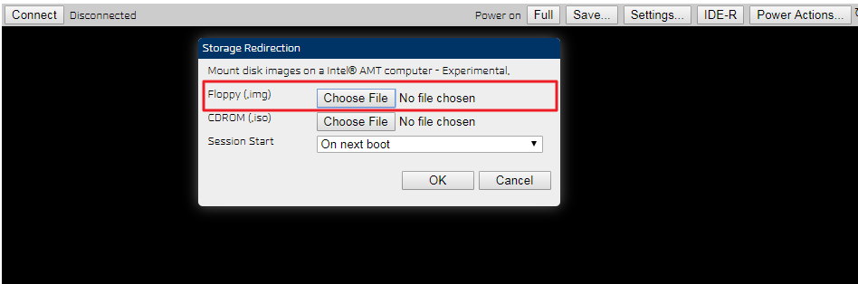

원격지의 이미지가 로딩되면 아래와 같이 상단에 Connected 로 표시되는 IDE-R 세션이
보입니다.

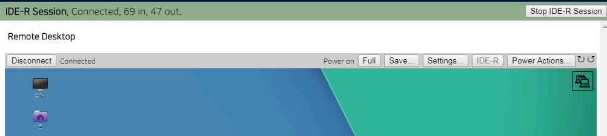

'Power Actions...' 버튼을 누르고 IDE-R 에서 지정한 디바이스로 부팅하도록 'Reset
to IDE-R Floopy' 또는 'Reset to IDE-R CDROM' 을 선택하면 컴퓨터가 재 시작되고
선택한 이미지로 부팅됩니다.

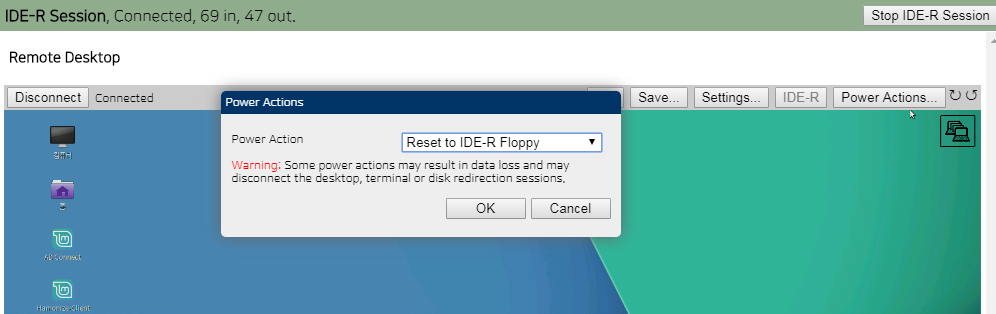

